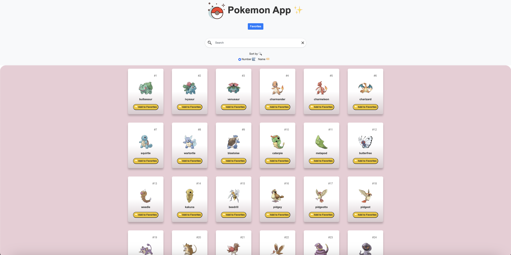
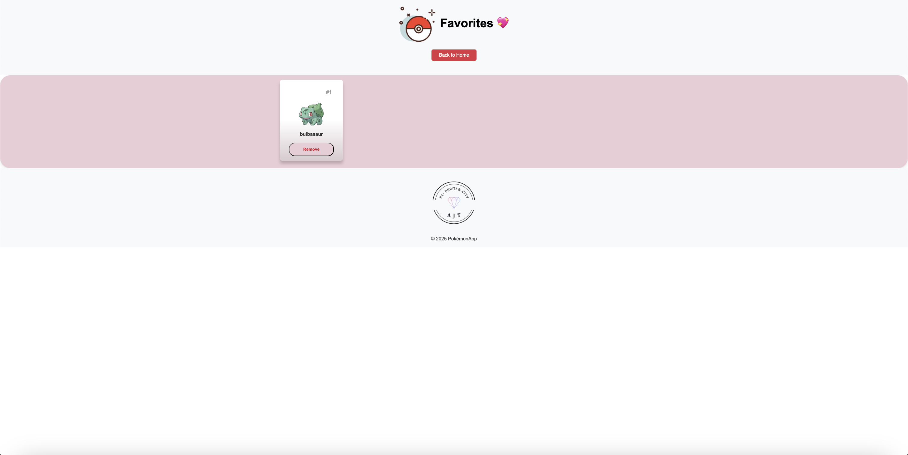
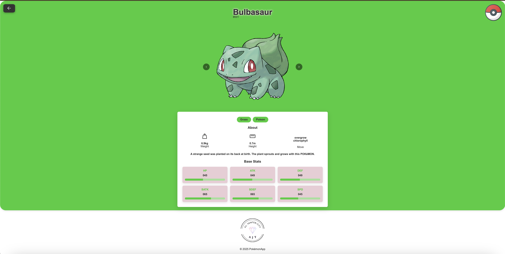

# Pokedex

Pokemon_App is an interactive web application that allows users to search for specific Pokémon, view their details, and save their favorite Pokémon for easy access. This project was created as part of a collaborative group effort to practice agile development and build a responsive front-end application.

### Table of Contents

- [About the Project](#about-the-project)
- [Features](#features)
- [Technologies Used](#technologies-used)
- [Screenshots](#screenshots)
- [Getting Started](#getting-started)
- [Future Enhancements](#future-enhancements)
- [Deployed Application](#deployed-application)
- [Credits](#credits)

### About the Project

Pokemon_App provides a seamless way to interact with Pokémon data. Users can:

Search for any Pokémon by name or ID.
View detailed stats and information.
Mark Pokémon as favorites to create a personalized collection.
Navigate between the main search page and the favorites page effortlessly.
The app demonstrates the collaborative efforts of a development team leveraging GitHub workflows, agile methodologies, and responsive design principles.

### Features:

- Search Functionality: Look up Pokémon by name or ID using an intuitive search bar.
- Favorites Management: Save and view favorite Pokémon on a dedicated page with persistent storage.
- Responsive Design: Accessible across devices of all screen sizes.
- CSS Framework Integration: Styled using Bootstrap.
- Interactive Modals: A Bootstrap modal confirms when a Pokémon is added to favorites.
- Client-Side Storage: Favorites are stored using localStorage, ensuring persistence across sessions.

### Some of the Technologies Used

<div align="left">
    
    
    
    
    
</div>

### Screenshots

<div>

-  
-  
-  

</div>

### Getting Started

Clone the repository:

```bash
git clone https://github.com/ThayRibeiro0/pokemon_app
```

#### Navigate to the project directory:

```bash
cd pokemon_app
```

Open index.html in your preferred web browser.
Deployment
Access the live application here.

### Future Enhancements

- Update the cursor icon to a hand symbol to indicate that images are clickable.
- Adjust the layout to ensure filter icons are evenly spaced for a cleaner design.
- Enable the search icon to initiate a search, in addition to pressing the Enter key.
- Create a dedicated section for team building under the Favorites page.
- Capitalize the first letter of each Pokémon name for consistency.
- Add a new feature to filter Pokémon by type for improved search functionality. 

### Credits and References

#### Team Members:

- Andrew
- John
- Thays

#### PokéAPI: The open-source API powering the Pokémon data.

#### Bootstrap: For seamless, responsive design.

### License

This project is licensed under the MIT License. See the LICENSE file for details.
